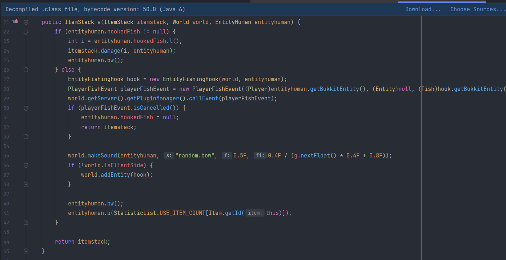

# Mixins

This is low level mixin for modifying existing java classes.
This concept was inspired by
[SpongePowered Mixin](https://github.com/SpongePowered/Mixin).

## Add to projects

### Maven
```xml
<repositories>
    <repository>
        <id>Mixins</id>
        <url>https://raw.github.com/joojn1122/Mixins/main/repository</url>
    </repository>
</repositories>

<dependencies>
    <dependency>
        <groupId>com.joojn</groupId>
        <artifactId>Mixins</artifactId>
        <version>Version (Can be found in repository folder)</version>
    </dependency>
</dependencies>
```

### Gradle
```gradle
repositories {
    maven { url 'https://github.com/joojn1122/Mixins/tree/main/repository' }
}

dependencies {
    implementation 'com.joojn:Mixins:Version'
}
```

Or you can download it from [Releases](../../releases).

## Development
The code is terrible and really hard to read so please don't judge me ¯\\\_(ツ)_/¯.
**It's still in development.**

It has a lot of bugs for example you can't use lambda expressions etc.

## To add target mixin
In resources folder you will need to create file `mixin-config.json`,
which looks like this

*(Right now this is only config this file has)*

```json
{
  "mixins" : [
    "path.to.your.mixin.class",
    ...
  ]
}
```

Then your class has to be annotated with
`@MixinTarget`

## Modifying existing method
To modify already existing method you 
need to annotate the method with `@MixinMethod`

```java
import com.joojn.mixins.Mixin;
import com.joojn.mixins.annotation.MixinTarget;
import com.joojn.mixins.annotation.MixinMethod;
import org.objectweb.asm.tree.ClassNode;
import org.objectweb.asm.tree.MethodNode;

@MixinTarget(targetClass = "com.example.class")
public class ExampleClassMixin {
    
    // override = false/true, default false -> if the whole method should be overridden 
    // atLine = int, default = 0 (start) -> at which line of method 
    // this should be injected (negative numbers works from other side => -1 = end)
    // if override is true, atLine is ignored
    // desc default @Desc() -> { 
    //    name default ""
    //    desc default ""
    // } = default is set to none = using method's name and method's params
    // you can override this when you want to have different method name or params
    @MixinMethod
    public void someMethodName() {
        System.out.println("Injected!");
    }
}
```

## Creating new method

Any method / field which is not annotated with @Shadow or @MixinMethod 
is automatically considered as new method / field

```java
public void newMethod(String someParams)
{
    System.out.println(someParams);
}
```

This will create `newMethod(java/lang/String;)V` in target class.

## Shadowing methods / fields

To shadow method / field, just simply annotate it with `@Shadow`
Let's say you want to shadow `super.someMethod(Ljava/lang/String;)I`
which compiler won't let you access it because it's
not extending that class

`@Shadow` have node argument which is empty by default 
=> it will use the field's / method's desc, but you can change it

```java
import com.joojn.mixins.Mixin;
import com.joojn.mixins.annotation.Desc;
import com.joojn.mixins.annotation.MixinMethod;
import com.joojn.mixins.annotation.MixinTarget;
import com.joojn.mixins.annotation.Shadow;
import com.joojn.mixins.annotation.ShadowFor;
import org.objectweb.asm.Opcodes;
import org.objectweb.asm.tree.ClassNode;
import org.objectweb.asm.tree.MethodInsnNode;

@MixinTarget(className = "your.class")
public abstract class YourClassMixin {

    // owner => call this method in super class
    // opcode => INVOKESPECIAL = super call
    // desc => {
    //   name = "someMethod" /** we have to use this,
    //      because 'someMethod(Ljava/lang/String;)I' is already declared
    //      in this class **/
    // }
    @Shadow(
            node = @Node(
                    owner = "your.super.class",
                    opcode = Opcodes.INVOKESPECIAL,
                    desc = @Desc(
                            name = "someMethod"
                            // optional: desc = "(Ljava/lang/String;)I"
                    )
            )
    )
    public abstract int super_someMethod(String name);

    /**  we can make it native, abstract or empty body, it doesn't matter
     its just placeholder, so we can call it  **/

    // inject method
    @MixinMethod(override = true)
    public int someMethod(String str) {
        System.out.println("Injected!");

        return super_someMethod(str); // we can use this shadowed method
    }
}
```

## Fake return
Let's say you have some method and want to 
return some value under some condition
else continue the code

We can use `MixinMain.FAKE_RETURN_%VALUE%`,
if your method is for example returning ClassLoader 
you have to return MixinMain.FAKE_OBJECT_RETURN and 
change return type to Object

(Obviously doesn't work with when override is true)

```java

import com.joojn.mixins.Mixin;
import com.joojn.mixins.MixinMain;
import com.joojn.mixins.annotation.Desc;
import com.joojn.mixins.annotation.MixinMethod;
import com.joojn.mixins.annotation.MixinTarget;
import com.joojn.mixins.annotation.Shadow;
import com.joojn.mixins.annotation.ShadowFor;
import org.objectweb.asm.Opcodes;
import org.objectweb.asm.tree.ClassNode;
import org.objectweb.asm.tree.MethodInsnNode;

@MixinTarget(className = "your.class")
public abstract class YourClassMixin {
    
    // mixin method is ignoring return type,
    // so it can be anything
    // let's say the 'someMethod()' is returning 
    // 'java.lang.ClassLoader' but you can simply use Object
    // Every primitive class has its own return type
    // Example: FAKE_INT_RETURN
    @MixinMethod
    public Object someMethod(String str) {
        if (str.equals("return me!")) return ClassLoader.getSystemClassLoader();

        // else continue code
        // return fake return which will be removed
        return MixinMain.FAKE_OBJECT_RETURN;
    }
}

```

## Make mixin works
To make all working you have to use [Java Agent](https://www.developer.com/design/what-is-java-agent/).

```java
package your.main.clazz;

import com.joojn.mixins.MixinMain;
import java.io.IOException;
import java.lang.instrument.Instrumentation;

public class Main {

    // premain which java agent is using
    public static void premain(String agentsArgs, Instrumentation inst) {

        try
        {
            MixinMain.loadMixins(inst); // load mixins, without this it won't work
        } 
        catch (IOException e) 
        {
            e.printStackTrace();
        }
    }
}
```

You also need to register this to the [MANIFEST.MF](https://docs.oracle.com/javase/tutorial/deployment/jar/manifestindex.html) file.

```manifest
Manifest-Version: 1.0
Premain-Class: your.main.clazz
Can-Redefine-Classes: true
Can-Retransform-Classes: true

```

## Showcase
**Before:**



**Code:** 


**After: (Screenshot from injected class file)**


## Conclusion
I hope you understood everything, if not you can contact me
on discord `joojn#5485` or open issue request.

I'll probably make YouTube video for setup in the future.
You can also look at 'AdvancedMixins'.

**Also, any help is appreciated, so you can create a pull request.**
